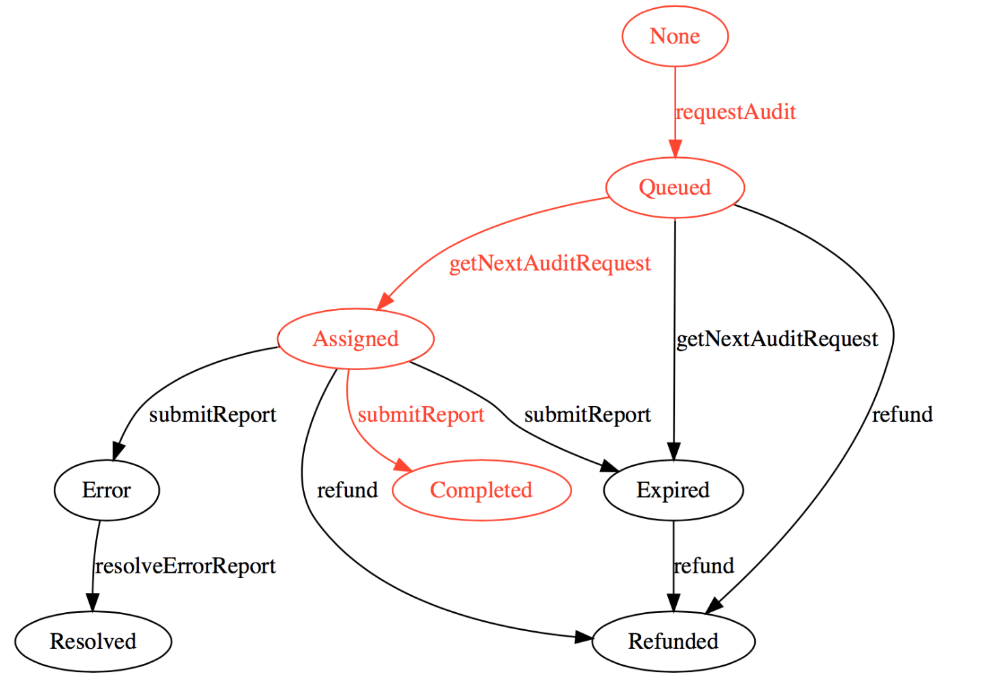

# Express Quantstamp as javascript

Quantstamp is a smart contract security audit system by scalable and cost-effective way. I express Quantstamp contracts as Javascript for better understanding. Please refer to white paper or official blog for more information.

## Get started

### Run install command
`npm install`

### Execute flow
`node main.js` 
If I puck pack all process into main.js, it will hard to read. So I will divide into several branches. Please checkout.

## Audit completed
Please checkout 'audit-completed' branch and refer to following blog post for further information. 

Blog Post: [Express Quantstamp contracts as javascript - Audit completed](https://medium.com/@t.tak/express-quantstamp-contracts-as-javascript-audit-completed-c53930cf7ed3)
 

 
